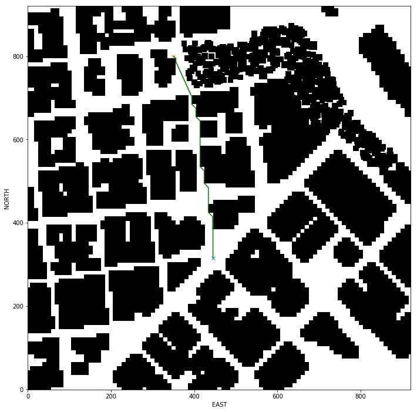
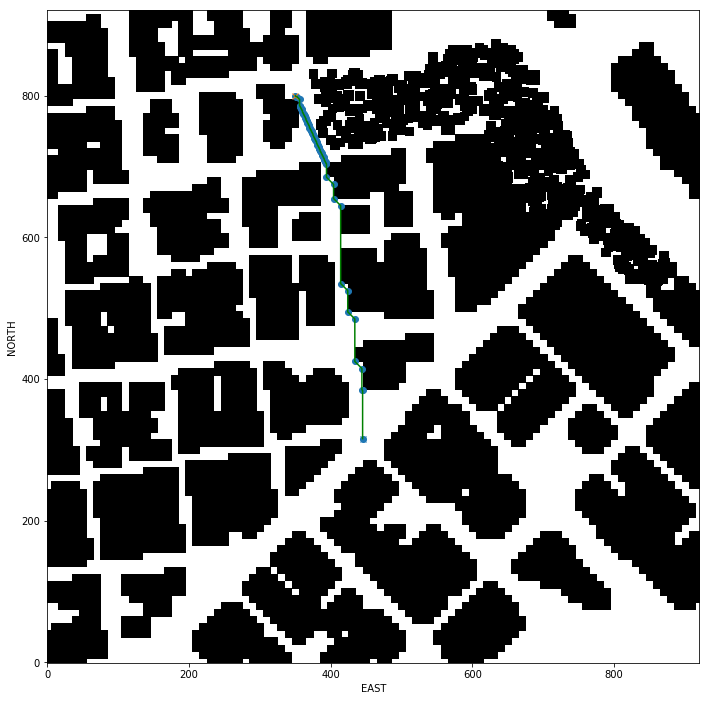
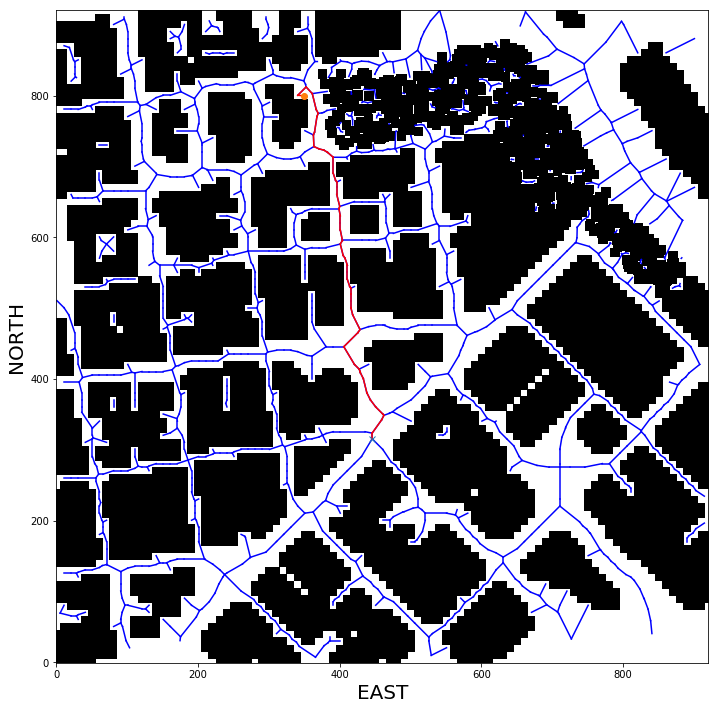

## Project: 3D Motion Planning


---


# Required Steps for a Passing Submission:
1. Load the 2.5D map in the colliders.csv file describing the environment.
2. Discretize the environment into a grid or graph representation.
3. Define the start and goal locations.
4. Perform a search using A* or other search algorithm.
5. Use a collinearity test or ray tracing method (like Bresenham) to remove unnecessary waypoints.
6. Return waypoints in local ECEF coordinates (format for `self.all_waypoints` is [N, E, altitude, heading], where the drone’s start location corresponds to [0, 0, 0, 0].
7. Write it up.
8. Congratulations!  Your Done!

## [Rubric](https://review.udacity.com/#!/rubrics/1534/view) Points
### Here I will consider the rubric points individually and describe how I addressed each point in my implementation.  

---
### Writeup / README

#### 1. Provide a Writeup / README that includes all the rubric points and how you addressed each one.  You can submit your writeup as markdown or pdf.  

You're reading it! Below I describe how I addressed each rubric point and where in my code each point is handled.

### Explain the Starter Code

#### 1. Explain the functionality of what's provided in `motion_planning.py` and `planning_utils.py`
These scripts contain a basic planning implementation that includes...

And here's a lovely image of my results (ok this image has nothing to do with it, but it's a nice example of how to include images in your writeup!)


Here's | A | Snappy | Table
--- | --- | --- | ---
1 | `highlight` | **bold** | 7.41
2 | a | b | c
3 | *italic* | text | 403
4 | 2 | 3 | abcd

### Implementing Your Path Planning Algorithm

#### 1. Set your global home position
Here students should read the first line of the csv file, extract lat0 and lon0 as floating point values and use the self.set_home_position() method to set global home. Explain briefly how you accomplished this in your code.


And here is a lovely picture of our downtown San Francisco environment from above!


#### 2. Set your current local position
Here as long as you successfully determine your local position relative to global home you'll be all set. Explain briefly how you accomplished this in your code.


Meanwhile, here's a picture of me flying through the trees!


#### 3. Set grid start position from local position
This is another step in adding flexibility to the start location. As long as it works you're good to go!

#### 4. Set grid goal position from geodetic coords
This step is to add flexibility to the desired goal location. Should be able to choose any (lat, lon) within the map and have it rendered to a goal location on the grid.

#### 5. Modify A* to include diagonal motion (or replace A* altogether)
Minimal requirement here is to modify the code in planning_utils() to update the A* implementation to include diagonal motions on the grid that have a cost of sqrt(2), but more creative solutions are welcome. Explain the code you used to accomplish this step.

#### 6. Cull waypoints 
For this step you can use a collinearity test or ray tracing method like Bresenham. The idea is simply to prune your path of unnecessary waypoints. Explain the code you used to accomplish this step.


### Execute the flight
#### 1. Does it work?
It works!

### Double check that you've met specifications for each of the [rubric](https://review.udacity.com/#!/rubrics/1534/view) points.
  
# Extra Challenges: Real World Planning

For an extra challenge, consider implementing some of the techniques described in the "Real World Planning" lesson. You could try implementing a vehicle model to take dynamic constraints into account, or implement a replanning method to invoke if you get off course or encounter unexpected obstacles.


# SOLUTION EXPLAINED

1. Started Code explanation
    - I can see from the starter code in `planning_utils.py` that only allowed motions are NORTH, SOUTH, EAST, WEST.
    - Diagonal motion is not set in it.
    - It has heuristic function defined for A* algorithm calculation.

2. Set home position to (lon0, lat0, 0) - As shown in the code snippet below I set the home position. This is the map center.
    ```python
    # TODO: set home position to (lon0, lat0, 0) -- Done
        self.set_home_position(lon0, lat0, 0.0)
        print("Home position set to Lat = {0}, Lon = {1}, Alt = {2}".format(lat0, lon0, 0.0))
    ```
    
2. Retrieve current global position - In the code snippet below I am getting drones current global position.
    ```python
    # TODO: retrieve current global position -- Done
        current_global_position = (self._longitude, self._latitude, self._altitude)
    ```
3. Convert to current local position using global_to_local() - In the code snippet below I am converting the global position to local position.
    ```python
    # TODO: convert to current local position using global_to_local() -- Done
        current_local_position = global_to_local(current_global_position, self.global_home)
    ```
    - This eables me to start from any current location of the drone.
4.  Adapt to set goal as latitude / longitude position and convert - I used some plotting scripts in [plots](./plots.ipynb) notebook to understand the local co-ordinates and then used the `local_to_global()` to get the gobal co-ordinates for my goal position.
    ```python
    # TODO: adapt to set goal as latitude / longitude position and convert
        goal_lat = 37.799669768530386
        goal_lon = -122.39341596913285
    ```

5. Add diagonal motions with a cost of sqrt(2) to your A* - I added diagonal motion to list of possible actions in the `planning_utils.py` script file.
    - Total number of waypoints in the path = 486
        

6. Prune path to minimize number of waypoints - I used collinearity check to prun the waypoints.
    - Total number of waypoints in the pruned path = 93
        

7. Try a different approach altogether - I tried to implement vornoi graph search as well.
    - As you can see in the image below the graph does not cover the edge cases, I decided not to use it and instead stick with the grid based A star approach.
    - Vornoi Graph Path - Total number of waypoints = 53
        
    - Vornoi Graph Pruned Path - Total number of waypoints = 49
        
